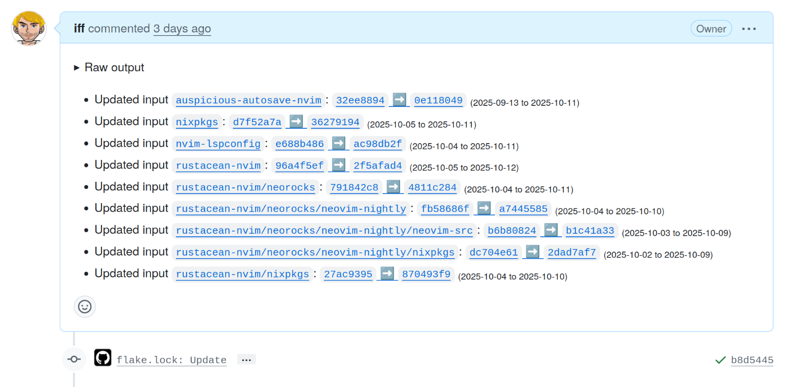

# flakers

**Note:** This is a very simple tool designed primarily for my personal workflows. Flakers is just a helper tool replacing [flake-to-markdown](https://github.com/sandhose/nixconf/blob/835aee30649b1df5b76303f372926cc974792245/misc/flake-to-markdown.awk): Parse a flake lock update commit and output (stdout) readable markdown with compare links to be consumed in a GitHub Action.

## installation (nix flake)

build with nix:

```
nix build github:iff/flakers
```

example use:

```
nix --accept-flake-config flake update --commit-lock-file
git log -1 --pretty=%B | tail +3 | nix run github:iff/flakers >> "${GITHUB_OUTPUT}"
```

example output:



